# PLAN.md — MarkUp: Chrome Extension Markdown Reader

> **Status:** v0.3.0 — All Phases Complete (1–11)  
> **Version:** 0.3.0  
> **Last Updated:** 2026-04-13  

---

## 1. Project Overview

### 1.1 Vision

**MarkUp** is a Chrome Extension that intercepts `.md` and `.markdown` file URLs (both `file://` and `https://` raw sources) and renders them as beautifully styled, interactive HTML documents — directly in the browser tab. It replaces the raw plaintext view with a rich reading experience featuring syntax-highlighted code blocks, a live table of contents, theme switching, and print-friendly output.

### 1.2 Core Feature Set

| # | Feature | Priority | Status |
|---|---------|----------|--------|
| F1 | Intercept & render local/remote `.md` files in-tab | P0 | ✅ |
| F2 | Full CommonMark + GFM spec parsing (tables, task lists, footnotes, strikethrough) | P0 | ✅ |
| F3 | Syntax-highlighted fenced code blocks (language auto-detect) | P0 | ✅ |
| F4 | Auto-generated, collapsible Table of Contents (TOC) from headings | P1 | ✅ |
| F5 | Light / Dark / Sepia theme toggle with persistence | P1 | ✅ |
| F6 | Typography controls (font family, size, line-height) | P2 | ✅ |
| F7 | Search-within-document (Ctrl+F overlay) | P2 | ✅ |
| F8 | Print / Export to PDF (clean layout) | P2 | ✅ |
| F9 | Extension popup with quick settings & recent files | P1 | ✅ |
| F10 | Keyboard shortcuts for navigation & actions | P2 | ✅ |

### 1.3 Non-Goals (v1)

- Live editing / WYSIWYG markdown composition.
- Syncing with cloud storage (Google Drive, Dropbox).
- Multi-file project/wiki navigation.

---

## 2. Directory & Folder Structure

```
markUp/
├── PLAN.md                        # This file — project roadmap (source of truth)
├── README.md                      # Setup, features, architecture (continuously updated)
├── AGENTS.md                      # Developer log (appended after every step)
├── LICENSE                        # MIT License
│
├── src/
│   ├── manifest.json              # Manifest V3 configuration
│   │
│   ├── background/
│   │   └── service-worker.js      # Background service worker (event-driven)
│   │
│   ├── content/
│   │   ├── content-script.js      # Entry point injected into .md tabs (MarkUpApp class)
│   │   └── content.css            # Master content styles
│   │
│   ├── popup/
│   │   ├── popup.html             # Extension popup UI
│   │   ├── popup.css              # Popup styles
│   │   └── popup.js               # Popup controller
│   │
│   ├── options/
│   │   ├── options.html           # Full options/settings page
│   │   ├── options.css            # Options page styles
│   │   └── options.js             # Options controller
│   │
│   ├── core/                      # OOP core modules
│   │   ├── MarkdownParser.js      # Parsing engine (wraps marked)
│   │   ├── Renderer.js            # Abstract base renderer
│   │   ├── HtmlRenderer.js        # Concrete HTML renderer (extends Renderer)
│   │   ├── TocGenerator.js        # Table of contents builder
│   │   ├── SyntaxHighlighter.js   # Code block highlighting manager
│   │   ├── ThemeManager.js        # Theme switching & persistence
│   │   ├── StorageManager.js      # chrome.storage abstraction
│   │   ├── MessageBus.js          # chrome.runtime messaging wrapper
│   │   ├── FileDetector.js        # URL/MIME sniffing for .md files
│   │   ├── SearchController.js    # In-document search logic
│   │   ├── PrintManager.js        # Print/export formatting
│   │   ├── KeyboardManager.js     # Keyboard shortcut handler
│   │   └── EventEmitter.js        # Lightweight pub/sub for decoupling
│   │
│   ├── ui/                        # UI component classes
│   │   ├── BaseComponent.js       # Abstract UI component base class
│   │   ├── ToolbarComponent.js    # Floating toolbar (TOC, theme, search triggers)
│   │   ├── TocPanelComponent.js   # Sidebar TOC panel
│   │   ├── SearchBarComponent.js  # Search overlay UI
│   │   └── SettingsPanelComponent.js  # Typography/display settings
│   │
│   ├── styles/                    # Theme stylesheets
│   │   ├── variables.css          # CSS custom properties (design tokens)
│   │   ├── themes/
│   │   │   ├── light.css
│   │   │   ├── dark.css
│   │   │   └── sepia.css
│   │   ├── typography.css         # Font & spacing tokens
│   │   ├── ui-components.css      # Toolbar, sidebars, search bar styles
│   │   ├── code-highlight.css     # Syntax highlighting theme
│   │   └── print.css              # Print-specific overrides
│   │
│   ├── utils/
│   │   ├── constants.js           # Enum-like constants, config defaults
│   │   ├── dom-helpers.js         # Safe DOM creation utilities
│   │   ├── sanitizer.js           # HTML sanitization layer
│   │   └── logger.js              # Debug logging utility (gated by settings)
│   │
│   ├── icons/                     # Extension icon copies (required in src/)
│   │   ├── icon-16.png
│   │   ├── icon-32.png
│   │   ├── icon-48.png
│   │   └── icon-128.png
│   │
│   └── vendor/                    # Vendored libs (copies for extension runtime)
│       ├── marked.min.js
│       └── highlight.min.js
│
├── assets/
│   └── icons/                     # Source icon files
│       ├── icon-16.png
│       ├── icon-32.png
│       ├── icon-48.png
│       └── icon-128.png
│
├── vendor/                        # Vendored third-party libs (source of truth)
│   ├── marked.min.js             # Markdown parser library (v15.0.12, MIT)
│   └── highlight.min.js          # Syntax highlighting library (v11.11.1, BSD-3)
│
├── tests/                         # Test suites & test data
│   ├── test-files/
│   │   ├── basic.md
│   │   ├── gfm-tables.md
│   │   ├── code-blocks.md
│   │   ├── edge-cases.md
│   │   └── large-document.md
│   ├── test-checklist.md
│   ├── phase{2-8}-browser-verify.html
│   └── phase9-step{91-95}-browser-verify.html
│
└── scripts/
    ├── build.sh                   # Placeholder for future build steps
    └── package.sh                 # Zip for Chrome Web Store submission
```

---

## 3. Core OOP Class Definitions & Responsibilities

### 3.1 Class Diagram (Conceptual)

```mermaid
classDiagram
    class EventEmitter {
        -Map~string, Function[]~ _listeners
        +on(event, callback) void
        +off(event, callback) void
        +emit(event, ...args) void
    }

    class MarkdownParser {
        -Object _parserOptions
        -Object _parserInstance
        +constructor(options)
        +parse(rawMarkdown) string
        +setOption(key, value) void
        -_initializeParser() void
    }

    class Renderer {
        <<abstract>>
        #string _targetSelector
        +render(content)* void
        +clear()* void
        +getContainer() HTMLElement
    }

    class HtmlRenderer {
        -HTMLElement _container
        -Sanitizer _sanitizer
        +render(htmlString) void
        +clear() void
        +injectStyles(cssText) void
        -_createShadowContainer() HTMLElement
    }

    class TocGenerator {
        -Object[] _headings
        +generate(htmlString) Object[]
        +toHtml() string
        -_buildTree(headings) Object[]
    }

    class SyntaxHighlighter {
        -Object _hljs
        -Set~string~ _supportedLanguages
        +highlightAll(container) void
        +highlightElement(element) void
        +addLanguage(name, definition) void
    }

    class ThemeManager {
        -string _currentTheme
        -StorageManager _storage
        +applyTheme(themeName) void
        +getTheme() string
        +getAvailableThemes() string[]
        -_loadThemeCSS(name) void
    }

    class StorageManager {
        -string _namespace
        +get(key) Promise~any~
        +set(key, value) Promise~void~
        +remove(key) Promise~void~
        +getAll() Promise~Object~
        -_prefixKey(key) string
    }

    class MessageBus {
        -Map~string, Function~ _handlers
        +send(action, payload) Promise~any~
        +listen(action, handler) void
        +unlisten(action) void
        -_onMessage(message, sender, sendResponse) void
    }

    class FileDetector {
        -RegExp[] _patterns
        -string[] _mimeTypes
        +isMarkdownUrl(url) boolean
        +isMarkdownMime(contentType) boolean
        +getFileNameFromUrl(url) string
        +setCustomExtensions(extensionsString) void
    }

    class SearchController {
        -string _query
        -HTMLElement[] _matches
        -number _currentIndex
        +search(query) number
        +nextMatch() void
        +prevMatch() void
        +clearHighlights() void
        -_highlightMatches(query) HTMLElement[]
    }

    class PrintManager {
        +preparePrintView() void
        +restoreView() void
        -_injectPrintStyles() void
    }

    class KeyboardManager {
        -Map~string, Function~ _bindings
        +register(combo, handler) void
        +unregister(combo) void
        +enable() void
        +disable() void
        -_onKeyDown(event) void
    }

    class BaseComponent {
        <<abstract>>
        #HTMLElement _element
        #string _id
        +mount(parent)* void
        +unmount()* void
        +show() void
        +hide() void
        +isVisible() boolean
        #_createElement(tag, attrs) HTMLElement
    }

    Renderer <|-- HtmlRenderer
    BaseComponent <|-- ToolbarComponent
    BaseComponent <|-- TocPanelComponent
    BaseComponent <|-- SearchBarComponent
    BaseComponent <|-- SettingsPanelComponent
    ThemeManager --> StorageManager
    HtmlRenderer ..> EventEmitter
    MessageBus ..> EventEmitter
```



### 3.2 Class Responsibility Matrix

| Class | Single Responsibility | Depends On |
|-------|----------------------|------------|
| `EventEmitter` | Lightweight pub/sub event system for decoupling modules | None |
| `MarkdownParser` | Convert raw Markdown string → HTML string | `marked` (vendor) |
| `Renderer` (abstract) | Define the rendering contract | — |
| `HtmlRenderer` | Safely inject parsed HTML into the DOM | `Renderer`, `Sanitizer` |
| `TocGenerator` | Extract headings from HTML and build nested TOC structure | None |
| `SyntaxHighlighter` | Apply syntax highlighting to `<code>` blocks post-render | `highlight.js` (vendor) |
| `ThemeManager` | Manage theme state and swap CSS | `StorageManager` |
| `StorageManager` | Abstract all `chrome.storage.sync`/`local` calls | None |
| `MessageBus` | Abstract all `chrome.runtime.sendMessage`/`onMessage` | `EventEmitter` |
| `FileDetector` | Determine if a URL/response is a Markdown file | None |
| `SearchController` | Full-text in-page search with match navigation | None |
| `PrintManager` | Prepare and restore print-optimized views | None |
| `KeyboardManager` | Centralized keyboard shortcut registry | None |
| `BaseComponent` (abstract) | Lifecycle contract for all UI components | None |
| `ToolbarComponent` | Floating action bar with toggle buttons | `BaseComponent` |
| `TocPanelComponent` | Sidebar TOC with scroll-spy and collapse | `BaseComponent`, `TocGenerator` |
| `SearchBarComponent` | Search overlay input and navigation | `BaseComponent`, `SearchController` |
| `SettingsPanelComponent` | Typography and display settings UI | `BaseComponent`, `ThemeManager`, `StorageManager` |
| `Logger` | Gated debug/warn/error logging utility | `StorageManager` |

---

## 4. Best Practices & Standards Guide

### 4.1 Manifest V3 Compliance

| Requirement | Implementation |
|-------------|---------------|
| Service Worker (non-persistent) | `background.service_worker` in manifest — NO background pages |
| No remote code execution | All JS bundled locally; NO `eval()`, `new Function()`, or CDN `<script>` tags |
| Content Security Policy | Explicit CSP in manifest: `"content_security_policy": { "extension_pages": "script-src 'self'; object-src 'none';" }` |
| Declarative Net Request | Use `declarativeNetRequest` if URL interception is needed (not `webRequest`) |
| Permissions | Minimal: `"activeTab"`, `"storage"`, `"scripting"`, `"tabs"` |

### 4.2 Content Security Policy (CSP)

- **NO inline scripts.** All event handlers wired via `addEventListener()`.
- **NO inline styles via `style` attribute in JS-generated HTML.** Use CSS classes exclusively.
- **NO `eval()` or `Function()` anywhere in the codebase.**
- **All CSS injected via `<link>` or `adoptedStyleSheets`**, never via string interpolation into `<style>`.

### 4.3 DOM Manipulation Standards

- All DOM creation via `document.createElement()` + safe attribute setters — **never `innerHTML` for user-facing content**.
- Use `textContent` for plaintext. Use the `Sanitizer` utility for any HTML that must be set via `innerHTML`.
- All DOM queries scoped to the smallest necessary subtree (avoid `document.querySelectorAll()` on the entire page).
- Use `DocumentFragment` for batched DOM insertions.
- Prefer `requestAnimationFrame()` for any layout-reading/writing cycles.

### 4.4 Memory Management

- All event listeners attached via named functions (not anonymous closures) to allow proper `removeEventListener()`.
- Every `BaseComponent` subclass must implement `unmount()` which removes all listeners and DOM nodes.
- `SearchController._matches[]` must be cleared on every new search to avoid retaining stale node references.
- Service worker must not hold global state — use `chrome.storage` for persistence.
- Use `WeakRef` / `FinalizationRegistry` for any observer patterns holding DOM node references.

### 4.5 Error Handling

- All `chrome.*` API calls wrapped in try/catch with `chrome.runtime.lastError` checks.
- `MarkdownParser.parse()` must catch and surface parsing errors gracefully (render error state, not crash).
- Content script injection failures must fail silently with console warning — never break the host page.

### 4.6 Code Style & Conventions

- **`globalThis.MARKUP_*` exports** for all modules (classic scripts — MV3 content scripts don't support ES modules).
- **JSDoc** on every public method.
- Class file naming: PascalCase matching class name (e.g., `MarkdownParser.js`).
- Constants: SCREAMING_SNAKE_CASE in `constants.js`, `Object.freeze()`-d.
- Private members prefixed with `_` (convention enforcement).
- CSS classes prefixed `markup-` (from `CSS_PREFIX` constant).
- Storage keys prefixed `markup_` (from `StorageManager._prefixKey()`).

---

## 5. Step-by-Step Implementation Guide

> **Convention:** Each step is tagged `[Phase.Step]`. Every step ends with a ✅ **Verify** block.  
> Do not proceed to the next step until verification passes.

---

### Phase 1: Project Scaffolding & Infrastructure ✅

#### ✅ Step 1.1 — Initialize Repository and Root Files

- Create the root directory structure: `src/`, `assets/`, `vendor/`, `tests/`, `scripts/`.
- Create empty placeholder files: `PLAN.md` (copy this), `README.md`, `AGENTS.md`.
- Write initial `README.md` header with project name, one-line description, and "Under Construction" badge.
- Write initial `AGENTS.md` with a header and first entry: "Step 1.1: Project initialized."

> ✅ **Verify:** `ls -R` shows the correct directory tree. `README.md` and `AGENTS.md` exist with content.

#### ✅ Step 1.2 — Create `manifest.json` (Manifest V3)

- Create `src/manifest.json` with:
  - `manifest_version: 3`
  - `name: "MarkUp"`
  - `version: "0.1.0"`
  - `description: "Render Markdown files beautifully in your browser"`
  - `permissions: ["activeTab", "storage", "scripting", "tabs"]`
  - `content_security_policy` for extension pages
  - `icons` referencing `icons/` (inside `src/`)
  - `background.service_worker` pointing to `background/service-worker.js`
  - `action.default_popup` pointing to `popup/popup.html`
  - `content_scripts` matching `*.md` URLs (with `file://` and `https://raw.githubusercontent.com/*`)

> ✅ **Verify:** Load as unpacked extension in `chrome://extensions` — no manifest errors. Extension icon appears.

#### ✅ Step 1.3 — Create Extension Icons

- Generate or create 4 icon sizes: 16×16, 32×32, 48×48, 128×128 PNG.
- Place in `assets/icons/` and copy to `src/icons/`.

> ✅ **Verify:** Extension shows custom icon in toolbar and `chrome://extensions`.

#### ✅ Step 1.4 — Create Minimal Service Worker Skeleton

- Create `src/background/service-worker.js` with:
  - `chrome.runtime.onInstalled` listener that logs "MarkUp installed" to console.
  - An empty `chrome.runtime.onMessage` listener skeleton.

> ✅ **Verify:** Inspect service worker via `chrome://extensions` → "Service worker" link. Console shows install message.

#### ✅ Step 1.5 — Create Minimal Content Script Skeleton

- Create `src/content/content-script.js` with a top-level log.
- Create `src/content/content.css` with an empty body rule as placeholder.

> ✅ **Verify:** Open a `.md` file in Chrome. Console shows the log message.

#### ✅ Step 1.6 — Document Phase 1

> ✅ **Verify:** Both `README.md` and `AGENTS.md` are updated and accurate.

---

### Phase 2: Core Utility & Foundation Classes ✅

#### ✅ Step 2.1 — Create `constants.js`

- Define constants: `THEMES`, `STORAGE_KEYS`, `EVENTS`, `DEFAULTS`, `MD_URL_PATTERNS`, `MD_MIME_TYPES`, `CSS_PREFIX`, `MAX_DOCUMENT_SIZE`.

> ✅ **Verify:** File parses without errors. Constants are importable.

#### ✅ Step 2.2 — Create `dom-helpers.js`

- Implement: `createElement()`, `createFragment()`, `removeAllChildren()`, `addStyles()`.

> ✅ **Verify:** Safe DOM creation works. No `innerHTML` usage.

#### ✅ Step 2.3 — Create `sanitizer.js`

- `Sanitizer` class: DOMParser-based, whitelist approach with `sanitize()` method.
- Static `createStrictConfig()` factory for CSP strict mode.

> ✅ **Verify:** Strips `<script>`, `<iframe>`, `onclick=` attributes. Allows `<strong>`, `<a href="">`.

#### ✅ Step 2.4 — Create `EventEmitter.js`

- `on()`, `off()`, `emit()`, `once()`. Uses `Set` for O(1) dedup.

> ✅ **Verify:** Register, emit, assert callback fired. `once` fires only once. `off` removes.

#### ✅ Step 2.5 — Document Phase 2

---

### Phase 3: Storage, Messaging & Detection Infrastructure ✅

#### ✅ Step 3.1 — Create `StorageManager.js`

- Namespaced, async, default-fallback. All methods wrap `chrome.storage` with `lastError` handling.

> ✅ **Verify:** Set a value → refresh → get returns persisted value.

#### ✅ Step 3.2 — Create `MessageBus.js`

- Action-based routing. `send()`, `listen()`, `unlisten()`, `destroy()`.

> ✅ **Verify:** Content script sends ping → service worker responds pong.

#### ✅ Step 3.3 — Create `FileDetector.js`

- Patterns for `.md`, `.markdown`, `.mdown`, `.mkd`, `.mdx`. Plus `setCustomExtensions()`.

> ✅ **Verify:** Test against various URLs. False positives for non-markdown.

#### ✅ Step 3.4 — Wire FileDetector into Service Worker

- `chrome.tabs.onUpdated` → dynamic injection via `chrome.scripting.executeScript()`.
- `injectedTabs` Set tracks already-injected tabs.

> ✅ **Verify:** Navigate to a `.md` file not covered by static matches → content script still loads.

#### ✅ Step 3.5 — Document Phase 3

---

### Phase 4: Markdown Parsing & Rendering Pipeline ✅

#### ✅ Step 4.1 — Vendor Third-Party Libraries

- `marked.min.js` (v15.0.12, MIT), `highlight.min.js` (v11.11.1, BSD-3-Clause).

> ✅ **Verify:** Files exist, are valid JS.

#### ✅ Step 4.2 — Create `MarkdownParser.js`

- GFM-enabled parser wrapping `new marked.Marked()` (isolated instance).

> ✅ **Verify:** Headings, code blocks, tables, task lists → correct HTML.

#### ✅ Step 4.3 — Create Abstract `Renderer.js`

> ✅ **Verify:** Instantiating `Renderer` directly throws. Subclass works.

#### ✅ Step 4.4 — Create `HtmlRenderer.js`

- Sanitize → DOMParser → `importNode()` → mount.

> ✅ **Verify:** `<script>` tags stripped. Styles don't leak to host page.

#### ✅ Step 4.5 — Create `SyntaxHighlighter.js`

- Wraps `hljs`. `highlightAll()`, `highlightElement()`.

> ✅ **Verify:** JS, Python, bash code blocks → syntax highlighting applied.

#### ✅ Step 4.6 — Create `TocGenerator.js`

- Heading extraction, slug generation, stack-based tree building.

> ✅ **Verify:** h1, h2, h2, h3, h2 → correctly nested TOC with unique IDs.

#### ✅ Step 4.7 — Wire Full Parse → Render Pipeline

- Content script pipeline: detect → extract → parse → render → highlight → TOC → title.
- Error fallback with styled error + collapsible raw Markdown.

> ✅ **Verify:** Open `.md` file → rich HTML, highlighted code, page title set.

#### ✅ Step 4.8 — Document Phase 4

---

### Phase 5: Theming & Styling System ✅

#### ✅ Step 5.1 — Create CSS Design Tokens (`variables.css`)

- 60+ CSS custom properties scoped under `.markup-content`.

#### ✅ Step 5.2 — Create Theme Stylesheets

- Light (GitHub-inspired), Dark (GitHub Dark Dimmed), Sepia (warm paper).
- Theme selectors: `.markup-content.markup-theme-{name}`.

#### ✅ Step 5.3 — Create `typography.css`

- Heading scale (~1.25 ratio), system font stacks.

#### ✅ Step 5.4 — Create `content.css`

- Master stylesheet — layout, tables, code, images, transitions.

#### ✅ Step 5.5 — Create `print.css`

- `@media print` — forces light, hides UI, page break control.

#### ✅ Step 5.6 — Create `ThemeManager.js`

- Theme switching + `StorageManager` persistence + `EventEmitter` emission.

#### ✅ Step 5.7 — Document Phase 5

---

### Phase 6: UI Components & Interactive Features ✅

#### ✅ Step 6.1 — Create `BaseComponent.js`

- Abstract lifecycle: `mount()`, `unmount()`, `show()`, `hide()`, `toggle()`.

#### ✅ Step 6.2 — Create `ToolbarComponent.js`

- Floating bar: TOC, Theme, Search, Print, Settings buttons. Auto-hide on scroll.

#### ✅ Step 6.3 — Create `TocPanelComponent.js`

- Left sidebar, IntersectionObserver scroll-spy, collapsible sections.

#### ✅ Step 6.4 — Create `SearchBarComponent.js`

- Search overlay, debounced input (200ms), keyboard nav.

#### ✅ Step 6.5 — Create `SearchController.js`

- TreeWalker text search, `<mark>` highlighting, DOM restoration.

#### ✅ Step 6.6 — Create `SettingsPanelComponent.js`

- Right sidebar — theme radios, font/line-height sliders, font family dropdown.

#### ✅ Step 6.7 — Create `PrintManager.js`

- `preparePrintView()` → `window.print()` → auto-restore via `afterprint`.

#### ✅ Step 6.8 — Create `KeyboardManager.js`

- Default shortcuts: `Alt+T` (TOC), `Alt+F` (search), `Alt+D` (theme), `Alt+P` (print).

#### ✅ Step 6.9 — Orchestrate All Components in Content Script

- Refactored into `MarkUpApp` class — 12-step pipeline.

#### ✅ Step 6.10 — Document Phase 6

---

### Phase 7: Popup, Options Page & Polish ✅

#### ✅ Step 7.1 — Build Popup UI

- Theme quick-switch, Enable MarkUp toggle, recent files list.

#### ✅ Step 7.2 — Build Options Page

- 4 sections: Appearance, Behavior, Advanced, About.

#### ✅ Step 7.3 — Track Recent Files in Service Worker

- `chrome.storage.local`, capped at 10 FIFO, `GET_RECENT_FILES` action.

#### ✅ Step 7.4 — UX Polish Pass

- Loading spinner (3-dot bounce), raw/rendered toggle, smooth transitions.

#### ✅ Step 7.5 — Accessibility Audit

- `aria-*` attributes, keyboard navigability, WCAG AA contrast.

#### ✅ Step 7.6 — Error States & Edge Cases

- Empty file, binary file detection, large file (>1MB) warning + "Load All".

#### ✅ Step 7.7 — Create Test Files

- `basic.md`, `gfm-tables.md`, `code-blocks.md`, `edge-cases.md`, `large-document.md`.

#### ✅ Step 7.8 — Final Documentation Update

#### ✅ Step 7.9 — Build & Package Script

- `scripts/package.sh` → `markup-extension-v{version}.zip`.

---

### Phase 8: UI Refinements & Live Settings ✅

#### ✅ Step 8.1 — Theme-Aware UI Panels & Toolbar

- `body.markup-body` CSS variables + theme overrides. ThemeManager toggles on both `.markup-content` and `body`.

#### ✅ Step 8.2 — Draggable Toolbar

- Drag handle button (`⠿`), PointerEvents API, position persisted to StorageManager.

#### ✅ Step 8.3 — Live Settings Application

- Service worker relays: `APPLY_THEME`, `APPLY_FONT_SIZE`, `APPLY_LINE_HEIGHT`, `APPLY_FONT_FAMILY`.
- Content script `MessageBus.listen()` handlers apply CSS custom properties immediately.

---

### Phase 9: Settings Backend Wiring ✅

> **Context:** Phase 7 built the Options page and Popup UI with save/load for settings. This phase wired each setting into its backend consumer.

#### ✅ Step 9.1 — Wire `enabled` Master Toggle

- **Content script:** `enabled` gate at start of `run()`. Info banner with "Enable" button when disabled.
- **Service worker:** `enabled` gate wrapping dynamic injection (async IIFE).
- **Popup + Options:** `APPLY_ENABLED` message broadcast on toggle change.

> ✅ **Verify:** Disable MarkUp → `.md` file shows raw text with banner. Re-enable → renders immediately.

#### ✅ Step 9.2 — Wire `debugLog` Toggle → Logger Utility

- Created `src/utils/logger.js` — static `Logger` class (`MARKUP_LOGGER`).
- `debug()` gated behind `_enabled` flag. `warn()`/`error()` always output.
- 28 `console.log()` calls converted across all modules.
- `APPLY_DEBUG_LOG` MessageBus relay for live toggle.

> ✅ **Verify:** Debug OFF (default) → no console output. Enable → verbose logs visible.

#### ✅ Step 9.3 — Unify & Simplify Settings

- Consolidated `autoDetect` + `autoRender` into single `enabled` master toggle.
- Removed `enableFileUrl` toggle entirely (global `enabled` is sufficient).
- Fixed bug: `APPLY_AUTO_DETECT` had no service worker listener.

| Setting | Location | Storage Key |
|---------|----------|-------------|
| Enable MarkUp | Popup + Options | `enabled` |
| File Extensions | Options → Behavior | `extensions` |

#### ✅ Step 9.4 — Wire Custom File Extensions

- `FileDetector.setCustomExtensions()` — merges with (never replaces) built-in defaults.
- Options UI split: readonly built-in + editable custom input.
- `APPLY_EXTENSIONS` relay broadcasts to all tabs.
- Regex injection prevented via special character escaping.

> ✅ **Verify:** Add `.txt` → renders. Remove → raw text. Built-in extensions always work.

#### ✅ Step 9.5 — Wire `cspStrict` Toggle

- Strict mode: strips ``, blocks external `<a href>` (only `#anchor` preserved), blocks `data:` URLs.
- `Sanitizer.createStrictConfig()` factory. `_reRender()` for live toggle.
- Default is `false` (relaxed) to avoid breaking images/links on install.

> ✅ **Verify:** Strict ON → external images stripped. Strict OFF → images appear. Live toggleable.

#### ✅ Step 9.6 — Tests & Documentation

- 5 per-step test suites: 345 total tests, all passing.
- All prior suites (Phase 2–8) pass with zero regressions.

---

## 6. Documentation Maintenance Strategy

### 6.1 `PLAN.md` Rules

| Rule | Detail |
|------|--------|
| **Ownership** | This file is the single source of truth for project scope and progress. |
| **Update Trigger** | Mark each step's status (`✅` Done) as work progresses. |
| **Scope Changes** | Any new feature or architectural change must be documented here FIRST. |
| **Freeze Policy** | After user approval, the Phase structure is frozen. Steps may be added within a Phase but Phases may not be reordered. |

### 6.2 `README.md` Rules

| Rule | Detail |
|------|--------|
| **Update Trigger** | After EVERY phase completion and after any user-visible feature is added. |
| **Required Sections** | Project description, Installation, Features, Keyboard Shortcuts, Architecture, Supported Formats, License. |
| **Keep Current** | README must never describe features that don't exist yet, or omit features that do. |

### 6.3 `AGENTS.md` Rules

| Rule | Detail |
|------|--------|
| **Update Trigger** | After EVERY implementation step. |
| **Purpose** | Compact audit trail for future AI agents. Architecture, conventions, deviations. |
| **Append-Only** | Never modify existing entries. Always append new entries at the bottom. |

---

## 7. Risk Register

| Risk | Likelihood | Impact | Mitigation |
|------|-----------|--------|------------|
| `marked.js` adds `eval()` usage in future versions | Low | High (CSP violation) | Pin dependency version. Test CSP compliance on every vendor update. |
| Shadow DOM breaks `highlight.js` styling | Medium | Medium | Deferred — using scoped styles with `markup-*` namespacing instead. |
| `file://` permission UX confuses users | High | Medium | Clear instructions in popup for enabling file access. Detect and show in-page guide. |
| Large documents cause jank | Medium | High | Implement virtual scrolling or chunked rendering for files >1000 lines. |
| Content script conflicts with host page JS | Low | Medium | CSS class namespacing with `markup-` prefix. |

---

## 8. Future Roadmap

### Phase 10: Download Interception — Render Instead of Download ✅

> **Context:** When Markdown files are shared in Google Chat, Slack, email, or any web app, clicking them triggers a download (`Content-Disposition: attachment`). The browser never navigates to a renderable page, so MarkUp's content script never runs. This phase intercepts `.md` downloads globally, cancels them, and renders the content in a new tab using the existing pipeline.

#### Step 10.1 — Add `downloads` Permission & Setting

- Add `"downloads"` to `manifest.json` `permissions` array.
- Add a new setting to the Settings Model:

| Setting | Storage Key | Default | Location | Consumer |
|---------|-------------|---------|----------|----------|
| Render downloads | `interceptDownloads` | `true` | Options → Behavior | service-worker download listener |

- Add toggle to Options page (Behavior section) and also in Popup: "Render Markdown downloads instead of saving"
  - Help text: "When you click a `.md` file link that would normally download, MarkUp opens it in a new tab instead."
- Add `APPLY_INTERCEPT_DOWNLOADS` MessageBus action for live toggle.
- Wire setting in `constants.js`: `DEFAULTS.INTERCEPT_DOWNLOADS: true`.

> ✅ **Verify:** New permission loads without errors. Toggle appears in Options and Popup. Setting persists.

#### Step 10.2 — Implement Download Listener in Service Worker

- In `service-worker.js`, add `chrome.downloads.onDeterminingFilename` listener:
  1. Check if the download filename ends with a known Markdown extension (use `FileDetector` patterns).
  2. Read `interceptDownloads` setting from `StorageManager` — if `false`, allow normal download.
  3. If match: cancel the download via `chrome.downloads.cancel(downloadId)`.
  4. Store the download URL and filename temporarily.
  5. Fetch the file content:
     - **Primary:** Use `fetch(downloadUrl)` from the service worker — cookies auto-attached for same-origin.
     - **Fallback:** If CORS/auth fails, use `chrome.tabs.create()` with the URL and let the content script handle detection.
  6. Create a renderable page:
     - **Option A (preferred):** Open `chrome.runtime.getURL('viewer.html') + '?url=' + encodeURIComponent(downloadUrl)` — a dedicated viewer page inside the extension that fetches and renders.
     - **Option B (fallback):** Create a `blob:` URL with `text/plain` MIME type → open in new tab → existing content script detects and renders.

```
User clicks .md attachment in Google Chat / Slack / Drive / Email
  → Browser starts download
  → chrome.downloads.onDeterminingFilename fires
  → FileDetector.isMarkdownFilename(suggestedFilename) → true
  → chrome.downloads.cancel(downloadId)
  → Fetch file content from download URL
  → Open in viewer.html or blob: tab
  → Existing MarkUp rendering pipeline runs
```

> ✅ **Verify:** Share a `.md` file in Google Chat → click it → instead of downloading, a new tab opens with rendered Markdown. Toggle setting OFF → file downloads normally.

#### Step 10.3 — Create `viewer.html` Extension Page

- Create `src/viewer/viewer.html`:
  - Minimal page that reads `?url=` query parameter.
  - Fetches the Markdown content via `fetch()` (extension pages have relaxed CORS).
  - Injects the raw Markdown into the page as a `<pre>` element.
  - Loads the content script pipeline (or duplicates the parse/render logic for extension context).
- Create `src/viewer/viewer.js`:
  - Parse URL params, fetch content, handle auth failures gracefully.
  - Show loading spinner during fetch.
  - On fetch failure: show error card with "Download instead" button that triggers `chrome.downloads.download({ url })`.
- Create `src/viewer/viewer.css`:
  - Reuses existing design tokens and theme system.
- Update `manifest.json`:
  - Ensure viewer page has access to all CSS/JS resources via `web_accessible_resources` if needed.

> ✅ **Verify:** Navigate to `chrome-extension://<id>/viewer/viewer.html?url=<markdown-file-url>` → content loads and renders. Viewer respects current theme and typography settings.

#### Step 10.4 — Handle Edge Cases & Auth Failures

- **Expired/auth-gated URLs:** Google Chat download URLs expire. If `fetch()` returns 401/403:
  - Show error: "This file requires authentication. [Download instead] [Try again]"
  - "Download instead" triggers `chrome.downloads.download({ url })` to fall back to normal behavior.
- **Large files:** Apply same >1MB warning as existing pipeline.
- **Non-Markdown false positives:** If fetched content looks binary (null bytes, non-printable ratio), cancel rendering and resume download.
- **User wants to download:** Add a "Save file" button to the rendered view (uses `chrome.downloads.download()`).
- **Race condition:** `onDeterminingFilename` fires synchronously — ensure download is canceled before the file starts writing to disk.

> ✅ **Verify:** Test with expired Google Chat link → error with download fallback. Test with binary `.md` file → normal download. Test "Save file" button → downloads the rendered file.

#### Step 10.5 — Popup Integration

- Add indicator to popup when a download was intercepted:
  - Show a subtle notification: "Rendered `notes.md` instead of downloading"
  - Add intercepted files to the existing "Recent Files" list.
- Add quick toggle in popup: "Render downloads" (mirrors Options setting).

> ✅ **Verify:** Intercept a download → popup shows notification. Toggle OFF in popup → next download saves normally.

#### Step 10.6 — Tests & Documentation

- Create `tests/phase10-browser-verify.html`:
  - Mock `chrome.downloads` API.
  - Test filename detection (`.md`, `.markdown`, `.mdown` etc.).
  - Test cancel + fetch + render flow.
  - Test setting toggle (ON/OFF).
  - Test auth failure fallback.
  - Test non-Markdown rejection.
- Update `AGENTS.md` with Phase 10 entry.
- Update `README.md` with download interception feature.

> ✅ **Verify:** All tests pass. All prior suites (Phase 2–9) pass with zero regressions.

---

### Phase 10.5 — Post-Release Polish ✅

> **Goal:** Fix bugs discovered in Phase 10 testing, consolidate branding, add UX improvements.

#### Step 10.5.1 — Save Button Fix ✅

- **Problem:** Viewer "Save file" button re-triggered download interception (infinite loop) and failed for expired URLs.
- **Fix:** Save button now creates a `Blob` from `_rawMarkdown` (already in memory) and uses `<a download>` trick.
- Service worker `_handleMarkdownDownload()` now skips `blob:` / `data:` URLs and downloads by own extension (`byExtensionId`).

#### Step 10.5.2 — Favicon Support ✅

- Content script `_setFavicon()` injects `<link rel="icon">` via `chrome.runtime.getURL()` for local `file://` pages.
- `viewer.html`, `popup.html`, `options.html` all have `<link rel="icon">` pointing to `icon-transparent.png`.
- `icon-transparent.png` added to `web_accessible_resources` so content scripts can reference it.

#### Step 10.5.3 — Icon Consolidation ✅

- All manifest icon entries and `` references consolidated to `icon-transparent.png`.
- Created `icon-256.png` and `icon-512.png` for Chrome Web Store submission.
- Created `icon-512-black.png` variant for dark backgrounds.

#### Step 10.5.4 — Version Consistency ✅

- Bumped version `0.1.0` → `0.3.0` across: `manifest.json`, `popup.html`, `options.html`, `package.sh`.
- Verified consistency with `README.md` and `PLAN.md` (already at `0.3.0`).

#### Step 10.5.5 — Developer Info & Clear History ✅

- Added "Developer: fakhrulsojib" row with LinkedIn link to options page About section.
- Added 🗑️ "Clear history" button in popup next to "Recent Files" heading.
- Added `CLEAR_RECENT_FILES` MessageBus handler in service worker.

> ✅ **Verify:** All tests pass. All prior suites pass with zero regressions.

---

### Phase 11 — Themed Extension Pages ✅

> **Goal:** The popup and options page should reflect the user's selected theme (light/dark/sepia) instead of always using a hardcoded light design.

#### Step 11.1 — Shared Theme Variables ✅

- ✅ Extract the core CSS custom properties (backgrounds, text colors, borders, accents) from the content themes (`light.css`, `dark.css`, `sepia.css`) into a shared theme stylesheet that popup and options pages can import.
- ✅ Ensure the popup and options pages load `variables.css` + the shared theme styles.
- ✅ Created `src/styles/extension-theme.css` with body-scoped theme variables for light/dark/sepia, including extension-specific tokens (`--markup-ext-*`), flash prevention, and smooth transitions.

#### Step 11.2 — Popup Theme Support ✅

- ✅ On popup open, read the current `theme` from `StorageManager`.
- ✅ Apply the theme class (e.g., `markup-theme-dark`) to the popup `<body>`.
- ✅ Update all popup CSS to use CSS custom properties instead of hardcoded colors.
- ✅ Theme quick-switch buttons should update the popup's own theme immediately.

#### Step 11.3 — Options Page Theme Support ✅

- ✅ On options page load, read the current `theme` from `StorageManager`.
- ✅ Apply the theme class to the options `<body>`.
- ✅ Update all options CSS to use CSS custom properties instead of hardcoded colors.
- ✅ Theme radio buttons / selectors should update the options page's own theme immediately.
- ✅ Reset button also resets the options page theme to default.

#### Step 11.4 — Live Theme Relay for Extension Pages ✅

- ✅ When `APPLY_THEME` is broadcast via `chrome.runtime.sendMessage()`, the popup and options pages listen and update their theme in real time.
- ✅ No flash of wrong theme on page load — `body.markup-theme-loading { opacity: 0 }` removed after theme class is applied.
- ✅ No service worker changes needed — existing relay already broadcasts to extension pages.

#### Step 11.5 — Testing & Verification ✅

- ✅ Create `tests/phase11-browser-verify.html` with tests for:
  - Theme class application on popup/options body
  - CSS custom property usage (no hardcoded colors)
  - Live theme switching via MessageBus
  - Regression checks for all prior phases
- ✅ 74 tests passed, 0 failed.
- ✅ Phase 10.5 regression suite: 41 passed, 0 failed.
- ✅ Updated `AGENTS.md`, `README.md`, `PLAN.md`.

> ✅ **Verified:** Popup and options pages visually match the selected theme. All prior test suites pass.

---

### Future Phases (Pipeline)

- **Phase 12:** Mermaid diagram rendering in fenced code blocks
- **Phase 13:** Math/LaTeX rendering (KaTeX)
- **Phase 14:** Custom CSS injection (user-provided stylesheets)
- **Phase 15:** Multi-file wiki navigation (relative link following)
- **Phase 16:** Chrome Web Store publication & auto-update

---

> **End of PLAN.md — v0.3.0 | Phases 1–11 Complete, Phase 12+ Planned**

