# PLAN.md — MarkUp: Chrome Extension Markdown Reader

> **Status:** v0.1.0 — Released  
> **Version:** 0.1.0  
> **Last Updated:** 2026-04-12  

---

## 1. Project Overview

### 1.1 Vision

**MarkUp** is a Chrome Extension that intercepts `.md` and `.markdown` file URLs (both `file://` and `https://` raw sources) and renders them as beautifully styled, interactive HTML documents — directly in the browser tab. It replaces the raw plaintext view with a rich reading experience featuring syntax-highlighted code blocks, a live table of contents, theme switching, and print-friendly output.

### 1.2 Core Feature Set

| # | Feature | Priority |
|---|---------|----------|
| F1 | Intercept & render local/remote `.md` files in-tab | P0 |
| F2 | Full CommonMark + GFM spec parsing (tables, task lists, footnotes, strikethrough) | P0 |
| F3 | Syntax-highlighted fenced code blocks (language auto-detect) | P0 |
| F4 | Auto-generated, collapsible Table of Contents (TOC) from headings | P1 |
| F5 | Light / Dark / Sepia theme toggle with persistence | P1 |
| F6 | Typography controls (font family, size, line-height) | P2 |
| F7 | Search-within-document (Ctrl+F overlay) | P2 |
| F8 | Print / Export to PDF (clean layout) | P2 |
| F9 | Extension popup with quick settings & recent files | P1 |
| F10 | Keyboard shortcuts for navigation & actions | P2 |

### 1.3 Non-Goals (v1)

- Live editing / WYSIWYG markdown composition.
- Syncing with cloud storage (Google Drive, Dropbox).
- Multi-file project/wiki navigation.

---

## 2. Directory & Folder Structure

```
markUp/
├── PLAN.md                        # This file — project roadmap (source of truth)
├── README.md                      # Setup, features, architecture (continuously updated)
├── AGENTS.md                      # Developer log (appended after every step)
│
├── src/
│   ├── manifest.json              # Manifest V3 configuration
│   │
│   ├── background/
│   │   └── service-worker.js      # Background service worker (event-driven)
│   │
│   ├── content/
│   │   ├── content-script.js      # Entry point injected into .md tabs
│   │   └── content.css            # Base content styles (injected)
│   │
│   ├── popup/
│   │   ├── popup.html             # Extension popup UI
│   │   ├── popup.css              # Popup styles
│   │   └── popup.js               # Popup controller
│   │
│   ├── options/
│   │   ├── options.html           # Full options/settings page
│   │   ├── options.css            # Options page styles
│   │   └── options.js             # Options controller
│   │
│   ├── core/                      # OOP core modules
│   │   ├── MarkdownParser.js      # Parsing engine (wraps marked/markdown-it)
│   │   ├── Renderer.js            # Abstract base renderer
│   │   ├── HtmlRenderer.js        # Concrete HTML renderer (extends Renderer)
│   │   ├── TocGenerator.js        # Table of contents builder
│   │   ├── SyntaxHighlighter.js   # Code block highlighting manager
│   │   ├── ThemeManager.js        # Theme switching & persistence
│   │   ├── StorageManager.js      # chrome.storage abstraction
│   │   ├── MessageBus.js          # chrome.runtime messaging wrapper
│   │   ├── FileDetector.js        # URL/MIME sniffing for .md files
│   │   ├── SearchController.js    # In-document search overlay
│   │   ├── PrintManager.js        # Print/export formatting
│   │   ├── KeyboardManager.js     # Keyboard shortcut handler
│   │   └── EventEmitter.js        # Lightweight pub/sub for decoupling
│   │
│   ├── ui/                        # UI component classes
│   │   ├── ToolbarComponent.js    # Floating toolbar (TOC, theme, search triggers)
│   │   ├── TocPanelComponent.js   # Sidebar TOC panel
│   │   ├── SearchBarComponent.js  # Search overlay UI
│   │   ├── SettingsPanelComponent.js  # Typography/display settings
│   │   └── BaseComponent.js       # Abstract UI component base class
│   │
│   ├── styles/                    # Theme stylesheets
│   │   ├── themes/
│   │   │   ├── light.css
│   │   │   ├── dark.css
│   │   │   └── sepia.css
│   │   ├── typography.css         # Font & spacing tokens
│   │   ├── code-highlight.css     # Syntax highlighting theme
│   │   ├── print.css              # Print-specific overrides
│   │   └── variables.css          # CSS custom properties (design tokens)
│   │
│   └── utils/
│       ├── constants.js           # Enum-like constants, config defaults
│       ├── dom-helpers.js         # Safe DOM creation utilities
│       └── sanitizer.js           # HTML sanitization layer
│
├── assets/
│   ├── icons/
│   │   ├── icon-16.png
│   │   ├── icon-32.png
│   │   ├── icon-48.png
│   │   └── icon-128.png
│   └── fonts/                     # Bundled fonts (optional, for offline)
│
├── vendor/                        # Vendored third-party libs (no CDN in MV3)
│   ├── marked.min.js             # Markdown parser library
│   └── highlight.min.js          # Syntax highlighting library
│
├── tests/                         # Manual & automated test artifacts
│   ├── test-files/
│   │   ├── basic.md
│   │   ├── gfm-tables.md
│   │   ├── code-blocks.md
│   │   ├── edge-cases.md
│   │   └── large-document.md
│   └── test-checklist.md          # Manual QA checklist per phase
│
└── scripts/
    ├── build.sh                   # Optional build/bundle script
    └── package.sh                 # Zip for Chrome Web Store submission
```

---

## 3. Core OOP Class Definitions & Responsibilities

### 3.1 Class Diagram (Conceptual)

```mermaid
classDiagram
    class EventEmitter {
        -Map~string, Function[]~ _listeners
        +on(event, callback) void
        +off(event, callback) void
        +emit(event, ...args) void
    }

    class MarkdownParser {
        -Object _parserOptions
        -Object _parserInstance
        +constructor(options)
        +parse(rawMarkdown) string
        +setOption(key, value) void
        -_initializeParser() void
    }

    class Renderer {
        <<abstract>>
        #string _targetSelector
        +render(content)* void
        +clear()* void
        +getContainer() HTMLElement
    }

    class HtmlRenderer {
        -HTMLElement _container
        -Sanitizer _sanitizer
        +render(htmlString) void
        +clear() void
        +injectStyles(cssText) void
        -_createShadowContainer() HTMLElement
    }

    class TocGenerator {
        -Object[] _headings
        +generate(htmlString) Object[]
        +toHtml() string
        -_buildTree(headings) Object[]
    }

    class SyntaxHighlighter {
        -Object _hljs
        -Set~string~ _supportedLanguages
        +highlightAll(container) void
        +highlightElement(element) void
        +addLanguage(name, definition) void
    }

    class ThemeManager {
        -string _currentTheme
        -StorageManager _storage
        +applyTheme(themeName) void
        +getTheme() string
        +getAvailableThemes() string[]
        -_loadThemeCSS(name) void
    }

    class StorageManager {
        -string _namespace
        +get(key) Promise~any~
        +set(key, value) Promise~void~
        +remove(key) Promise~void~
        +getAll() Promise~Object~
        -_prefixKey(key) string
    }

    class MessageBus {
        -Map~string, Function~ _handlers
        +send(action, payload) Promise~any~
        +listen(action, handler) void
        +unlisten(action) void
        -_onMessage(message, sender, sendResponse) void
    }

    class FileDetector {
        -RegExp[] _patterns
        -string[] _mimeTypes
        +isMarkdownUrl(url) boolean
        +isMarkdownMime(contentType) boolean
        +getFileNameFromUrl(url) string
    }

    class SearchController {
        -string _query
        -HTMLElement[] _matches
        -number _currentIndex
        +search(query) number
        +nextMatch() void
        +prevMatch() void
        +clearHighlights() void
        -_highlightMatches(query) HTMLElement[]
    }

    class PrintManager {
        +preparePrintView() void
        +restoreView() void
        -_injectPrintStyles() void
    }

    class KeyboardManager {
        -Map~string, Function~ _bindings
        +register(combo, handler) void
        +unregister(combo) void
        +enable() void
        +disable() void
        -_onKeyDown(event) void
    }

    class BaseComponent {
        <<abstract>>
        #HTMLElement _element
        #string _id
        +mount(parent)* void
        +unmount()* void
        +show() void
        +hide() void
        +isVisible() boolean
        #_createElement(tag, attrs) HTMLElement
    }

    Renderer <|-- HtmlRenderer
    BaseComponent <|-- ToolbarComponent
    BaseComponent <|-- TocPanelComponent
    BaseComponent <|-- SearchBarComponent
    BaseComponent <|-- SettingsPanelComponent
    ThemeManager --> StorageManager
    HtmlRenderer ..> EventEmitter
    MessageBus ..> EventEmitter
```



### 3.2 Class Responsibility Matrix

| Class | Single Responsibility | Depends On |
|-------|----------------------|------------|
| `EventEmitter` | Lightweight pub/sub event system for decoupling modules | None |
| `MarkdownParser` | Convert raw Markdown string → HTML string | `marked` (vendor) |
| `Renderer` (abstract) | Define the rendering contract | — |
| `HtmlRenderer` | Safely inject parsed HTML into the DOM | `Renderer`, `Sanitizer` |
| `TocGenerator` | Extract headings from HTML and build nested TOC structure | None |
| `SyntaxHighlighter` | Apply syntax highlighting to `<code>` blocks post-render | `highlight.js` (vendor) |
| `ThemeManager` | Manage theme state and swap CSS | `StorageManager` |
| `StorageManager` | Abstract all `chrome.storage.sync`/`local` calls | None |
| `MessageBus` | Abstract all `chrome.runtime.sendMessage`/`onMessage` | `EventEmitter` |
| `FileDetector` | Determine if a URL/response is a Markdown file | None |
| `SearchController` | Full-text in-page search with match navigation | None |
| `PrintManager` | Prepare and restore print-optimized views | None |
| `KeyboardManager` | Centralized keyboard shortcut registry | None |
| `BaseComponent` (abstract) | Lifecycle contract for all UI components | None |
| `ToolbarComponent` | Floating action bar with toggle buttons | `BaseComponent` |
| `TocPanelComponent` | Sidebar TOC with scroll-spy and collapse | `BaseComponent`, `TocGenerator` |
| `SearchBarComponent` | Search overlay input and navigation | `BaseComponent`, `SearchController` |
| `SettingsPanelComponent` | Typography and display settings UI | `BaseComponent`, `ThemeManager`, `StorageManager` |

---

## 4. Best Practices & Standards Guide

### 4.1 Manifest V3 Compliance

| Requirement | Implementation |
|-------------|---------------|
| Service Worker (non-persistent) | `background.service_worker` in manifest — NO background pages |
| No remote code execution | All JS bundled locally; NO `eval()`, `new Function()`, or CDN `<script>` tags |
| Content Security Policy | Explicit CSP in manifest: `"content_security_policy": { "extension_pages": "script-src 'self'; object-src 'none';" }` |
| Declarative Net Request | Use `declarativeNetRequest` if URL interception is needed (not `webRequest`) |
| Permissions | Minimal: `"activeTab"`, `"storage"`, `"scripting"`. Request `file://` access via optional permission |

### 4.2 Content Security Policy (CSP)

- **NO inline scripts.** All event handlers wired via `addEventListener()`.
- **NO inline styles via `style` attribute in JS-generated HTML.** Use CSS classes exclusively.
- **NO `eval()` or `Function()` anywhere in the codebase.**
- **All CSS injected via `<link>` or `adoptedStyleSheets`**, never via string interpolation into `<style>`.

### 4.3 DOM Manipulation Standards

- All DOM creation via `document.createElement()` + safe attribute setters — **never `innerHTML` for user-facing content**.
- Use `textContent` for plaintext. Use the `Sanitizer` utility for any HTML that must be set via `innerHTML`.
- All DOM queries scoped to the smallest necessary subtree (avoid `document.querySelectorAll()` on the entire page).
- Use `DocumentFragment` for batched DOM insertions.
- Prefer `requestAnimationFrame()` for any layout-reading/writing cycles.

### 4.4 Memory Management

- All event listeners attached via named functions (not anonymous closures) to allow proper `removeEventListener()`.
- Every `BaseComponent` subclass must implement `unmount()` which removes all listeners and DOM nodes.
- `SearchController._matches[]` must be cleared on every new search to avoid retaining stale node references.
- Service worker must not hold global state — use `chrome.storage` for persistence.
- Use `WeakRef` / `FinalizationRegistry` for any observer patterns holding DOM node references.

### 4.5 Error Handling

- All `chrome.*` API calls wrapped in try/catch with `chrome.runtime.lastError` checks.
- `MarkdownParser.parse()` must catch and surface parsing errors gracefully (render error state, not crash).
- Content script injection failures must fail silently with console warning — never break the host page.

### 4.6 Code Style & Conventions

- **ES Modules** syntax (`import`/`export`) within extension pages; classic script concatenation for content scripts (MV3 content script limitation).
- **JSDoc** on every public method.
- Class file naming: PascalCase matching class name (e.g., `MarkdownParser.js`).
- Constants: SCREAMING_SNAKE_CASE in `constants.js`.
- Private members prefixed with `_` (convention enforcement).

---

## 5. Step-by-Step Implementation Guide (Micro-Steps)

> **Convention:** Each step is tagged `[Phase.Step]`. Every step ends with a ✅ **Verify** block.  
> Do not proceed to the next step until verification passes.

---

### Phase 1: Project Scaffolding & Infrastructure

#### (Done) Step 1.1 — Initialize Repository and Root Files

- Create the root directory structure: `src/`, `assets/`, `vendor/`, `tests/`, `scripts/`.
- Create empty placeholder files: `PLAN.md` (copy this), `README.md`, `AGENTS.md`.
- Write initial `README.md` header with project name, one-line description, and "Under Construction" badge.
- Write initial `AGENTS.md` with a header and first entry: "Step 1.1: Project initialized."

> ✅ **Verify:** `ls -R` shows the correct directory tree. `README.md` and `AGENTS.md` exist with content.

#### (Done) Step 1.2 — Create `manifest.json` (Manifest V3)

- Create `src/manifest.json` with:
  - `manifest_version: 3`
  - `name: "MarkUp"`
  - `version: "0.1.0"`
  - `description: "Render Markdown files beautifully in your browser"`
  - `permissions: ["activeTab", "storage", "scripting"]`
  - `content_security_policy` for extension pages
  - `icons` referencing `assets/icons/`
  - `background.service_worker` pointing to `background/service-worker.js`
  - `action.default_popup` pointing to `popup/popup.html`
  - `content_scripts` matching `*.md` URLs (with `file://` and `https://raw.githubusercontent.com/*`)
- Leave `options_page` commented out for now.

> ✅ **Verify:** Load as unpacked extension in `chrome://extensions` — no manifest errors. Extension icon appears.

#### (Done) Step 1.3 — Create Extension Icons

- Generate or create 4 icon sizes: 16×16, 32×32, 48×48, 128×128 PNG.
- Place in `assets/icons/`.
- Verify manifest references are correct.

> ✅ **Verify:** Extension shows custom icon in toolbar and `chrome://extensions`.

#### (Done) Step 1.4 — Create Minimal Service Worker Skeleton

- Create `src/background/service-worker.js` with:
  - `chrome.runtime.onInstalled` listener that logs "MarkUp installed" to console.
  - An empty `chrome.runtime.onMessage` listener skeleton.
- No business logic yet — just prove the lifecycle works.

> ✅ **Verify:** Inspect service worker via `chrome://extensions` → "Service worker" link. Console shows install message. No errors.

#### (Done) Step 1.5 — Create Minimal Content Script Skeleton

- Create `src/content/content-script.js` with:
  - A top-level `console.log("MarkUp content script loaded on:", window.location.href)`.
  - No DOM manipulation yet.
- Create `src/content/content.css` with an empty body rule as placeholder.

> ✅ **Verify:** Open a `.md` file in Chrome (local or raw GitHub). Console shows the log message.

#### (Done) Step 1.6 — Append to AGENTS.md

- Document steps 1.1–1.5 completion, manifest configuration decisions, and any issues encountered.
- Update `README.md` with "Loading the Extension" instructions.

> ✅ **Verify:** Both documentation files are updated and accurate.

---

### Phase 2: Core Utility & Foundation Classes

#### (Done) Step 2.1 — Create `constants.js`

- Define constants:
  - `THEMES: { LIGHT: 'light', DARK: 'dark', SEPIA: 'sepia' }`
  - `STORAGE_KEYS: { THEME: 'markup_theme', FONT_SIZE: 'markup_fontSize', ... }`
  - `EVENTS: { THEME_CHANGED: 'themeChanged', CONTENT_PARSED: 'contentParsed', ... }`
  - `DEFAULTS: { THEME: 'light', FONT_SIZE: 16, LINE_HEIGHT: 1.6, FONT_FAMILY: 'system-ui' }`
  - `MD_URL_PATTERNS: [...]` — regex patterns for markdown URL detection.

> ✅ **Verify:** File parses without errors. Constants are importable.

#### (Done) Step 2.2 — Create `dom-helpers.js`

- Implement utility functions (not a class — pure functions):
  - `createElement(tag, attributes, children)` — safe element factory.
  - `createFragment(elements)` — batch DOM insertion helper.
  - `removeAllChildren(element)` — safe child removal.
  - `addStyles(cssText, id)` — inject a `<style>` tag with dedup check.
- Each function must **never** use `innerHTML`.

> ✅ **Verify:** Write a quick inline test in content-script.js that creates a `<div>` with `createElement` and appends it. Confirm it renders. Remove the test code.

#### (Done) Step 2.3 — Create `sanitizer.js`

- Implement a `Sanitizer` class:
  - Constructor accepts a whitelist config (allowed tags, attributes).
  - `sanitize(htmlString)` → returns cleaned HTML string.
  - Uses a DOMParser-based approach (parse, walk, strip disallowed nodes).
  - Default whitelist: standard Markdown output tags (`p, h1-h6, a, img, code, pre, ul, ol, li, table, thead, tbody, tr, th, td, blockquote, em, strong, del, hr, br, input[type=checkbox]`).

> ✅ **Verify:** Sanitizer strips `<script>`, `<iframe>`, `onclick=` attributes. Allows `<strong>`, `<a href="">`.

#### (Done) Step 2.4 — Create `EventEmitter.js`

- Implement class with:
  - `_listeners` as a `Map<string, Set<Function>>`.
  - `on(event, callback)`, `off(event, callback)`, `emit(event, ...args)`.
  - `once(event, callback)` — auto-removes after first invocation.
  - Guard against duplicate listener registration.

> ✅ **Verify:** Unit-test inline: register, emit, assert callback fired. Test `once` fires only once. Test `off` removes. Remove test code.

#### (Done) Step 2.5 — Append to AGENTS.md

- Document Phase 2 completion, utility API surfaces, sanitizer whitelist decisions.

> ✅ **Verify:** AGENTS.md updated.

---

### Phase 3: Storage, Messaging & Detection Infrastructure

#### (Done) Step 3.1 — Create `StorageManager.js`

- Implement class:
  - Constructor accepts `namespace` string (default: `'markup'`) and `storageArea` (`'sync'` or `'local'`).
  - `_prefixKey(key)` → `${namespace}_${key}`.
  - `async get(key)` → returns value or default from `DEFAULTS`.
  - `async set(key, value)` → persists to `chrome.storage`.
  - `async remove(key)`.
  - `async getAll()` → returns all namespaced keys.
  - All methods wrap `chrome.storage` calls with `chrome.runtime.lastError` handling.

> ✅ **Verify:** From popup/options page context, set a value → refresh extension → get returns persisted value.

#### (Done) Step 3.2 — Create `MessageBus.js`

- Implement class:
  - `_handlers` as `Map<string, Function>`.
  - `send(action, payload)` → wraps `chrome.runtime.sendMessage({ action, payload })` returning a Promise.
  - `listen(action, handler)` → registers on `chrome.runtime.onMessage`.
  - `unlisten(action)`.
  - Internal `_onMessage` dispatcher that routes by `action` field.
  - Must handle the `sendResponse` async pattern correctly (return `true` from listener).

> ✅ **Verify:** Content script sends a ping → service worker receives and responds with pong → content script logs pong.

#### (Done) Step 3.3 — Create `FileDetector.js`

- Implement class:
  - `_patterns`: array of RegExp for `.md`, `.markdown`, `.mdown`, `.mkd`, `.mdx` extensions.
  - `isMarkdownUrl(url)` → tests URL pathname against patterns.
  - `isMarkdownMime(contentType)` → checks for `text/markdown`, `text/x-markdown`, `text/plain` with `.md` extension.
  - `getFileNameFromUrl(url)` → extracts filename from URL path.
  - Handle query strings and fragments in URLs.

> ✅ **Verify:** Test against: `file:///docs/README.md`, `https://raw.githubusercontent.com/user/repo/main/README.md`, `https://example.com/doc.md?v=2`, `https://example.com/page` (should return false).

#### (Done) Step 3.4 — Wire FileDetector into Service Worker

- In `service-worker.js`:
  - Import/include `FileDetector`.
  - Listen for `chrome.tabs.onUpdated` events.
  - When a tab navigates to a detected Markdown URL, use `chrome.scripting.executeScript()` to inject the content script (if not already declared in manifest match patterns).
  - This provides dynamic injection for URLs not caught by static `content_scripts` matches.

> ✅ **Verify:** Navigate to a `.md` file not covered by static matches → content script still loads.

#### (Done) Step 3.5 — Append to AGENTS.md

- Document Phase 3, messaging protocol design, file detection patterns.
- Update `README.md` with supported file types.

> ✅ **Verify:** Documentation updated.

---

### Phase 4: Markdown Parsing & Rendering Pipeline

#### (Done) Step 4.1 — Vendor Third-Party Libraries

- Download `marked.min.js` (latest stable) and place in `vendor/`.
- Download `highlight.min.js` (highlight.js, with common language bundle) and place in `vendor/`.
- Download one highlight.js CSS theme (e.g., `github.css`) → place in `src/styles/code-highlight.css`.
- Ensure no license violations — include `LICENSE` files in `vendor/`.

> ✅ **Verify:** Files exist, are valid JS. `vendor/` contains license files.

#### (Done) Step 4.2 — Create `MarkdownParser.js`

- Implement class:
  - Constructor accepts options object (GFM tables, task lists, breaks, headerIds, etc.).
  - `_initializeParser()` → configures `marked` instance with options and custom tokenizers/renderers if needed.
  - `parse(rawMarkdown)` → returns HTML string.
  - `setOption(key, value)` → updates parser config dynamically.
  - Must configure `marked` to NOT use `eval` or `new Function`.
  - Enable GFM, tables, task lists, strikethrough, footnotes.

> ✅ **Verify:** Pass a test markdown string with headings, code blocks, tables, and task lists → output is correct HTML.

#### (Done) Step 4.3 — Create Abstract `Renderer.js`

- Implement abstract base class:
  - `_targetSelector` — CSS selector for mount point.
  - Abstract `render(content)` method (throws if not overridden).
  - Abstract `clear()` method.
  - Concrete `getContainer()` → returns the mount point element.

> ✅ **Verify:** Instantiating `Renderer` directly throws an error. Subclass can be created.

#### (Done) Step 4.4 — Create `HtmlRenderer.js`

- Extends `Renderer`:
  - `_container` — the wrapper `<article>` element.
  - `_sanitizer` — instance of `Sanitizer`.
  - `render(htmlString)`:
    1. Sanitize the HTML.
    2. Clear the existing container.
    3. Parse sanitized HTML via DOMParser.
    4. Walk the parsed DOM and clone nodes into `_container` using `importNode`.
    5. Append `_container` to the target mount point.
  - `clear()` → removes all children from container.
  - `injectStyles(cssText)` → adds scoped styles.
  - Consider using Shadow DOM for style isolation from the host page.

> ✅ **Verify:** Render a known HTML string → inspect DOM. Verify `<script>` tags are stripped. Verify styles don't leak to host page.

#### (Done) Step 4.5 — Create `SyntaxHighlighter.js`

- Implement class:
  - Wraps `highlight.js` (`hljs`).
  - `highlightAll(container)` → finds all `<pre><code>` in container, applies highlighting.
  - `highlightElement(codeElement)` → highlights a single element.
  - `addLanguage(name, definition)` → register additional language.
  - `_supportedLanguages` → Set of loaded language names.
  - Must handle `language-*` class detection on `<code>` elements.

> ✅ **Verify:** Render markdown with JS, Python, and bash code blocks → syntax highlighting applied (colored tokens in DOM).

#### (Done) Step 4.6 — Create `TocGenerator.js`

- Implement class:
  - `generate(container)` → walks DOM for `h1`-`h6` elements, returns array of `{ level, text, id }`.
  - `_buildTree(headings)` → nests flat heading list into tree structure.
  - `toHtml()` → returns nested `<ul><li>` HTML from tree.
  - Assigns unique `id` attributes to heading elements if missing (for anchor links).
  - Handles duplicate heading texts by appending suffix counters.

> ✅ **Verify:** Document with h1, h2, h2, h3, h2 → TOC tree is correctly nested with unique IDs.

#### (Done) Step 4.7 — Wire the Full Parse → Render Pipeline in Content Script

- In `content-script.js`:
  1. Detect that the page contains raw Markdown (check `document.contentType` or `<pre>` tag).
  2. Extract raw text from the page.
  3. Instantiate `MarkdownParser`, parse to HTML.
  4. Instantiate `HtmlRenderer`, render HTML into the page (replacing raw content).
  5. Instantiate `SyntaxHighlighter`, highlight all code blocks.
  6. Instantiate `TocGenerator`, generate TOC data (store for Phase 5).
  7. Set page `<title>` to first `<h1>` or filename.
  - Wrap entire pipeline in error handling — if anything fails, show a styled error message, don't leave page blank.

> ✅ **Verify:** Open a `.md` file → raw text is replaced with rich HTML. Code blocks are highlighted. Page title is set. No console errors.

#### (Done) Step 4.8 — Append to AGENTS.md

- Document Phase 4, library versions, parser configuration, rendering strategy (Shadow DOM decision).
- Update `README.md` with supported Markdown features.

> ✅ **Verify:** Documentation updated.

---

### Phase 5: Theming & Styling System

#### (Done) Step 5.1 — Create CSS Design Tokens (`variables.css`)

- Define CSS custom properties for:
  - Colors: `--bg-primary`, `--bg-secondary`, `--text-primary`, `--text-secondary`, `--text-link`, `--border`, `--accent`.
  - Typography: `--font-body`, `--font-mono`, `--font-size-base`, `--line-height`.
  - Spacing: `--space-xs` through `--space-xl`.
  - Radii, shadows, transition durations.
- All values must be theme-agnostic defaults.

> ✅ **Verify:** Variables file is valid CSS. Custom properties are correctly namespaced.

#### (Done) Step 5.2 — Create Theme Stylesheets (`light.css`, `dark.css`, `sepia.css`)

- Each theme file overrides the CSS custom properties defined in `variables.css`.
- **Light:** Clean whites, dark text, blue links, subtle gray borders.
- **Dark:** Deep charcoal/navy background, light gray text, cyan accents, softer shadows.
- **Sepia:** Paper-like warm background (#f4ecd8), dark brown text, muted orange accents.

> ✅ **Verify:** Manually swap theme CSS class on the root element → all colors update correctly. No hardcoded colors outside the variable system.

#### (Done) Step 5.3 — Create `typography.css`

- Define font stacks, heading scales (modular scale), paragraph spacing, list styles, blockquote styling, horizontal rule styling.
- Use the CSS custom properties from `variables.css`.
- Import a web font via `@font-face` (bundled in `assets/fonts/`) or reference a system font stack.

> ✅ **Verify:** Rendered markdown uses correct typography. Headings are visually distinct. Body text is readable.

#### (Done) Step 5.4 — Create `content.css`

- Master stylesheet that `@import`s `variables.css`, `typography.css`, and the default theme.
- Styles the main content container: max-width, padding, centering.
- Styles Markdown-specific elements: tables (bordered, striped rows), task lists (checkbox styling), images (max-width, centered), links (colored, underlined on hover).

> ✅ **Verify:** Full markdown document renders with polished styling. Tables, images, and lists look professional.

#### (Done) Step 5.5 — Create `print.css`

- `@media print` overrides:
  - Remove toolbar, TOC sidebar, search bar.
  - Force light theme colors.
  - Ensure code blocks don't overflow (wrap).
  - Page break control for headings and code blocks.

> ✅ **Verify:** Ctrl+P → print preview shows clean, single-column layout without UI chrome.

#### (Done) Step 5.6 — Create `ThemeManager.js`

- Implement class:
  - Constructor receives `StorageManager` instance.
  - `_currentTheme` — loaded from storage on init (default: `THEMES.LIGHT`).
  - `applyTheme(themeName)`:
    1. Validate `themeName` against `THEMES` enum.
    2. Remove current theme class from root element.
    3. Add new theme class.
    4. Persist to `StorageManager`.
    5. Emit `EVENTS.THEME_CHANGED` via `EventEmitter`.
  - `getTheme()` → returns `_currentTheme`.
  - `getAvailableThemes()` → returns `Object.values(THEMES)`.

> ✅ **Verify:** Call `applyTheme('dark')` → page switches to dark. Refresh → dark persists. Switch to sepia → persists.

#### (Done) Step 5.7 — Append to AGENTS.md

- Document Phase 5, color palette decisions, font choices.
- Update `README.md` with theme features.

> ✅ **Verify:** Documentation updated.

---

### Phase 6: UI Components & Interactive Features (Done)

#### Step 6.1 — Create `BaseComponent.js` (Done)

- Implement abstract class:
  - `_element` — root HTMLElement of the component.
  - `_id` — unique identifier string.
  - `_mounted` — boolean state.
  - Abstract `mount(parentElement)` — subclasses must implement.
  - Abstract `unmount()` — subclasses must implement (must remove event listeners and DOM).
  - Concrete `show()` → sets `display` to its default.
  - Concrete `hide()` → sets `display: none`.
  - Concrete `isVisible()` → returns boolean.
  - Protected `_createElement(tag, attrs)` → delegates to `dom-helpers`.

> ✅ **Verify:** Cannot instantiate directly. Subclass with mount/unmount implemented works.

#### Step 6.2 — Create `ToolbarComponent.js` (Done)

- Extends `BaseComponent`:
  - Renders a fixed-position floating toolbar (top-right or bottom-right).
  - Buttons: TOC toggle, Theme toggle, Search toggle, Print, Settings.
  - Each button emits an event (via `EventEmitter`) — does NOT directly call other classes.
  - Smooth show/hide animation.
  - Auto-hides on scroll down, reveals on scroll up (optional, configurable).

> ✅ **Verify:** Toolbar renders. Each button click logs its event. Toolbar hides/shows on scroll.

#### Step 6.3 — Create `TocPanelComponent.js` (Done)

- Extends `BaseComponent`:
  - Renders a slide-in sidebar panel with the TOC HTML from `TocGenerator`.
  - Each TOC item is clickable → smooth-scrolls to the heading.
  - Scroll-spy: highlights the currently visible heading's TOC entry.
  - Collapsible sections for nested headings.
  - Resizable panel width (optional, stretch goal).

> ✅ **Verify:** Toggle TOC → panel slides in. Click TOC item → page scrolls to heading. Current heading highlighted.

#### Step 6.4 — Create `SearchBarComponent.js` (Done)

- Extends `BaseComponent`:
  - Renders a dropdown search bar (similar to browser's Ctrl+F).
  - Input field + match count + prev/next buttons + close button.
  - Wires to `SearchController` for actual search logic.
  - Keyboard: Enter for next, Shift+Enter for prev, Escape to close.

> ✅ **Verify:** Toggle search → bar appears. Type query → matches highlighted in document. Navigate works. Close clears highlights.

#### Step 6.5 — Create `SearchController.js` (Done)

- Implement class (not a UI component, pure logic):
  - `search(query)` → uses TreeWalker to find text nodes matching query. Wraps matches in `<mark>` elements. Returns match count.
  - `nextMatch()` / `prevMatch()` → scrolls to and highlights the active match.
  - `clearHighlights()` → removes all `<mark>` wrappers, restoring original text nodes.
  - `_currentIndex` tracks position in match list.
  - Case-insensitive by default, with option for case-sensitive.

> ✅ **Verify:** Search for a term → correct match count. Next/prev cycle through all matches. Clear restores original DOM.

#### Step 6.6 — Create `SettingsPanelComponent.js` (Done)

- Extends `BaseComponent`:
  - Renders a settings panel (modal or sidebar) with:
    - Theme selector (radio buttons or dropdown).
    - Font size slider (12–24px).
    - Line height slider (1.2–2.0).
    - Font family dropdown (system, serif, sans-serif, monospace).
  - All changes apply live (instant preview).
  - All settings persisted via `StorageManager`.

> ✅ **Verify:** Open settings → change font size → text resizes live. Close and reopen → setting persisted.

#### Step 6.7 — Create `PrintManager.js` (Done)

- Implement class:
  - `preparePrintView()`:
    1. Add `markup-print-mode` CSS class to root.
    2. Hide toolbar, TOC, search bar.
    3. Inject `print.css` if not already present.
    4. Call `window.print()`.
  - `restoreView()`:
    1. Remove `markup-print-mode` class.
    2. Restore hidden UI components.
  - Listen for `afterprint` event to auto-restore.

> ✅ **Verify:** Click print → print dialog shows clean layout. After closing dialog, UI is restored.

#### Step 6.8 — Create `KeyboardManager.js` (Done)

- Implement class:
  - `_bindings` — `Map<string, Function>` where key is combo like `ctrl+shift+f`.
  - `register(combo, handler)` → normalizes combo string, adds to map.
  - `unregister(combo)` → removes binding.
  - `_onKeyDown(event)` → translates KeyboardEvent to combo string, looks up and calls handler.
  - `enable()` / `disable()` → attaches/removes the keydown listener.
  - Default bindings (registered in content-script orchestration):
    - `ctrl+shift+t` → Toggle TOC.
    - `ctrl+shift+f` → Toggle Search.
    - `ctrl+shift+d` → Cycle Theme.
    - `ctrl+p` → Print.

> ✅ **Verify:** Press each shortcut → corresponding feature activates. Test in both light and dark themes.

#### Step 6.9 — Orchestrate All Components in Content Script (Done)

- Refactor `content-script.js` into a clean `MarkUpApp` orchestrator class:
  1. Initialize all managers: `StorageManager`, `ThemeManager`, `MessageBus`, `EventEmitter`.
  2. Run the parse → render pipeline (Phase 4).
  3. Mount all UI components: Toolbar, TOC Panel, Search Bar.
  4. Register keyboard shortcuts.
  5. Apply persisted theme and typography settings.
  6. Wire inter-component events: Toolbar button → shows/hides panels. Theme change → re-applies.
  - Error boundary around everything.

> ✅ **Verify:** Full end-to-end experience works: open .md file → styled content, toolbar, TOC, search, themes, keyboard shortcuts.

#### Step 6.10 — Append to AGENTS.md (Done)

- Document Phase 6, component architecture, keyboard shortcuts, known issues.
- Update `README.md` with feature list and keyboard shortcuts table.

> ✅ **Verify:** Documentation updated.

---

### Phase 7: Popup, Options Page & Polish

#### Step 7.1 — Build Popup UI (`popup.html`, `popup.css`, `popup.js`) ✅ Done

- Design popup layout:
  - Extension name/logo header.
  - Current theme quick-switch (3 theme icon buttons).
  - Toggle switches: "Enable on file:// URLs", "Auto-detect .md files".
  - Recent files list (last 5 Markdown URLs opened, stored in `StorageManager`).
  - "Options" link → opens options page.
- `popup.js`:
  - Instantiate `StorageManager` and `MessageBus`.
  - Load and display current settings.
  - On change → persist via `StorageManager` and notify content script via `MessageBus`.

> ✅ **Verify:** Click extension icon → popup appears. Theme switch works. Settings persist across popup close/reopen.

#### Step 7.2 — Build Options Page (`options.html`, `options.css`, `options.js`) ✅ Done

- Full settings page with sections:
  - **Appearance:** Theme, font size, line height, font family (mirrors SettingsPanel but on a dedicated page).
  - **Behavior:** Auto-render toggle, file extensions whitelist (editable).
  - **Advanced:** CSP mode (strict/relaxed), debug logging toggle.
  - **About:** Version, links, credits.
- Update `manifest.json` to add `options_page`.

> ✅ **Verify:** Right-click extension → Options → page opens. All settings save and load correctly. Overrides apply to content script.

#### Step 7.3 — Track Recent Files in Service Worker ✅ Done

- In `service-worker.js`:
  - When a Markdown file is detected and rendered, save `{ url, title, timestamp }` to `chrome.storage.local`.
  - Maintain a capped list (last 10 files, FIFO).
  - Expose via `MessageBus` action `GET_RECENT_FILES`.

> ✅ **Verify:** Open 3 different .md files → popup shows them in recent list. Open 12 → oldest 2 are pruned.

#### Step 7.4 — UX Polish Pass ✅ Done

- Add CSS transitions/animations:
  - Toolbar button hover effects.
  - TOC panel slide-in/out transition (300ms ease).
  - Search bar drop-down animation.
  - Theme transition (background-color, color fading — not abrupt swap).
- Add loading state: show a subtle spinner/skeleton while parsing large Markdown files.
- Add "Back to raw" toggle button — switches between rendered and raw Markdown view.

> ✅ **Verify:** All transitions feel smooth and professional. Large file shows loading indicator before content appears.

#### Step 7.5 — Accessibility Audit ✅ Done

- Add `aria-*` attributes to all interactive components:
  - `aria-label` on toolbar buttons.
  - `aria-expanded` on TOC toggle.
  - `role="search"` on search bar.
  - `role="navigation"` on TOC panel.
- Ensure full keyboard navigability (Tab order, Enter/Space activation).
- Ensure color contrast meets WCAG AA for all themes.

> ✅ **Verify:** Navigate entire UI with keyboard only. Run Chrome DevTools Lighthouse accessibility audit → score ≥ 90.

#### Step 7.6 — Error States & Edge Cases ✅ Done

- Handle edge cases:
  - Empty `.md` file → show "This file is empty" message.
  - Binary file with `.md` extension → detect and show "Not a valid Markdown file".
  - Extremely large file (>1MB) → show warning, offer to render first 500 lines with "Load more".
  - No permissions for `file://` → show instructions to enable file access.
- Each error state should have styled, user-friendly UI (not raw console errors).

> ✅ **Verify:** Test each edge case manually with test files in `tests/test-files/`.

#### Step 7.7 — Create Test Files ✅ Done

- Create comprehensive test Markdown files in `tests/test-files/`:
  - `basic.md` — Headings, paragraphs, bold, italic, links, images.
  - `gfm-tables.md` — Tables with alignment, complex cell content.
  - `code-blocks.md` — Fenced blocks in 5+ languages, inline code.
  - `edge-cases.md` — Nested blockquotes, deeply nested lists, HTML in Markdown, XSS payloads.
  - `large-document.md` — 1000+ lines to test performance and scrolling.
- Create `tests/test-checklist.md` — Manual QA checklist covering all features.

> ✅ **Verify:** Each test file opens and renders correctly. Edge cases file doesn't break the renderer. XSS payloads are sanitized.

#### Step 7.8 — Final Documentation Update ✅ Done

- **`README.md`** — Complete with:
  - Project description and screenshots.
  - Installation instructions (unpacked load).
  - Feature list with descriptions.
  - Keyboard shortcuts table.
  - Architecture overview with class diagram.
  - File extension support.
  - Contributing guidelines.
  - License.
- **`AGENTS.md`** — Complete development log with all steps.
- **`PLAN.md`** — Mark all steps as ✅ completed. Update status to "v0.1.0 Released".

> ✅ **Verify:** A new developer can read README.md and set up the extension. All three files are complete and consistent.

#### Step 7.9 — Build & Package Script ✅ Done

- Create `scripts/package.sh`:
  - Copies `src/`, `assets/`, and `vendor/` to a `dist/` directory.
  - Excludes test files, `AGENTS.md`, `PLAN.md`.
  - Zips `dist/` into `markup-extension-v0.1.0.zip`.
- Create `scripts/build.sh` (optional, if any transpilation is added later).

> ✅ **Verify:** Run package script → zip file created. Load from zip via Chrome → extension works identically.

---

## 6. Documentation Maintenance Strategy

### 6.1 `PLAN.md` Rules

| Rule | Detail |
|------|--------|
| **Ownership** | This file is the single source of truth for project scope and progress. |
| **Update Trigger** | Mark each step's status (`🔲 TODO`, `🔨 IN PROGRESS`, `✅ DONE`) as work progresses. |
| **Scope Changes** | Any new feature or architectural change must be documented here FIRST, with a new step number. |
| **Freeze Policy** | After user approval, the Phase structure is frozen. Steps may be added within a Phase but Phases may not be reordered. |

### 6.2 `README.md` Rules

| Rule | Detail |
|------|--------|
| **Update Trigger** | After EVERY phase completion and after any user-visible feature is added. |
| **Required Sections** | Project description, Installation, Features, Keyboard Shortcuts, Architecture, Supported Formats, License. |
| **Screenshots** | Must be added after Phase 5 (when the UI is styled). |
| **Keep Current** | README must never describe features that don't exist yet, or omit features that do. |

### 6.3 `AGENTS.md` Rules

| Rule | Detail |
|------|--------|
| **Update Trigger** | After EVERY implementation step (not just phases — every `Step X.Y`). |
| **Entry Format** | Each entry must include: Timestamp, Step ID, What was implemented, Technical decisions made, Current project state, Any issues or deviations from PLAN.md. |
| **Append-Only** | Never modify existing entries. Always append new entries at the bottom. |
| **Purpose** | This file serves as an audit trail. A new developer should be able to read it chronologically and understand every decision made. |

### 6.4 Entry Template for AGENTS.md

```markdown
---
### [Step X.Y] — [Step Title]
**Date:** YYYY-MM-DD
**Status:** Completed / Partial / Blocked

**What was implemented:**
- Bullet-point list of changes.

**Technical decisions:**
- Why a specific approach was chosen.

**Current state:**
- What works now. What's next.

**Issues / Deviations:**
- Any problems encountered or deviations from PLAN.md.
---
```

---

## 7. Risk Register

| Risk | Likelihood | Impact | Mitigation |
|------|-----------|--------|------------|
| `marked.js` adds `eval()` usage in future versions | Low | High (CSP violation) | Pin dependency version. Test CSP compliance on every vendor update. |
| Shadow DOM breaks `highlight.js` styling | Medium | Medium | Test early in Phase 4. Fallback: use scoped styles without Shadow DOM. |
| `file://` permission UX confuses users | High | Medium | Clear instructions in popup for enabling file access. Detect and show in-page guide. |
| Large documents cause jank | Medium | High | Implement virtual scrolling or chunked rendering for files >1000 lines. |
| Content script conflicts with host page JS | Low | Medium | Shadow DOM isolation. Namespace all CSS classes with `markup-` prefix. |

---

> **End of PLAN.md — v0.1.0 Released**
